# 多模态时序预测论文整理


当前已发表的多模态时序预测模型论文的关注点和区别主要在：

1. 文本来自哪里：历史文本、未来文本、静态描述，还是人为构造的上下文。
2. 文本粒度是多少：序列的每个时间点各有一个文本，或者一条序列只有一个文本
3. 文本怎么进入模型：拼接、cross-attention、作为 prompt，还是直接放进 LLM 问答。
4. 最终谁负责预测：传统时序模型、扩散模型、LLM，还是多个结果加权融合。

| 论文 | 文本粒度 | 时间 | 核心融合方式 | 一句话概括 | 期刊 |
| --- | --- | --- | --- | --- | --- |
| TGForecaster | 时间点/预测区间动态文本 + 通道描述 | 未来文本+通道描述 | 两层 cross-attention | 用通道描述去找相关动态文本，再用融合文本增强历史时序 | 无 |
| TaTS | 时间戳历史文本 | 历史文本 | 文本向量作为额外变量拼到时序里 | 把文本当作一种有周期特征的辅助时序变量 | ICLR 2026 |
| Time-MMD / MM-TSFlib | 单条窗口文本 | 未来起点文本 | 文本预测结果与时序预测结果加权融合 | 时序模型先预测，文本模型再做修正 | NeurIPS 2024 |
| TextFusionHTS | 每条时序一个静态文本 | 静态描述 | 文本 token 对历史 patch 做 cross-attention | 用文本判断哪些历史片段更重要 | NeurIPS 2024 |
| MCD-TSF | 时间戳历史文本 | 历史文本 | 扩散模型 + 时间戳注意力 + 文本 cross-attention | 在扩散去噪每一步中融合时间戳和文本 | 无 |
| GPT4MTS | 时间戳历史文本 | 历史文本 | soft prompt + GPT-2 self-attention | 把文本和时序 patch 都放进 GPT-2 隐空间预测 | AAAI 2024 |
| Time-LLM | 自动生成 prompt | 由历史时序生成文本 | 时序 patch 重编码到 LLM 词向量空间 | 让冻结 LLM 处理被改造成“语言 token”的时序 | ICLR 2024 |
| CIK | 任务上下文文本 | 任务给定上下文 | 直接 prompt LLM | 把时序和文本都写进提示词，让 LLM 输出预测 | ICLR 2026 | 

# 1、逐时间点

这一类方法的文本和具体时间有关。文本是每个时间点一段描述。

## 1.1、TGForecaster（未发表）

论文：Beyond Trend and Periodicity: Guiding Time Series Forecasting with Textual Cues  
代码：https://github.com/VEWOXIC/TGTSF

TGForecaster 用两类文本：

- 通道描述：模型是多变量预测模型，每个变量自己的静态说明，例如 temperature、humidity、pressure 各自是什么意思。
- 动态文本：和未来预测区间相关的新闻、天气描述或事件描述。

特点：用两层cross-attention依次找通道文本和动态文本、融合文本和时序关系。   
`seq_len = 288,pred_len = 96,patch_len = 6,stride = 3,text_dim = 768,d_model = 768,变量数 C = 21`  
`L_text=96/3=32:每3日取一个文本点，每段文本只被压缩为1个文本向量；patch_num=(288-6)/3+1=95:每个patch含6个时间点`    
第一层：通道描述作为 query，未来窗口动态文本作为 key/value，得到每个变量对应的文本特征。过程：  
`（[batch, 32, 21, 768]，[batch, 32, 7, 768]）——>[batch, 32, 21, 768]`  
作用是让每个变量自己去找整段文本中与自己相关的字段。（模型学习“某个变量描述”应该关注哪些天气文本，每天的文本有7段，各被压缩为1个句向量，对应21个变量）

第二层：第一层融合后的文本特征作为 query，历史时序作为 key/value，得到最相关重要的历史时序特征。  
`[batch, 288, 21]->[batch, 21, 95, 6]->[batch, 95, 21, 768],([batch, 32, 21, 768],[batch, 95, 21, 768])->[batch, 32, 21, 768]`  
作用是用“带未来窗口文本信息的通道特征”去选择历史时序里有用的模式，最后输出未来序列。

最后：用融合的文本-时序特征作为输入，经过线性层为每个融合位置预测一个未来时序 patch，然后按照 stride 将多个预测 patch 重叠拼接并平均，最终得到长度为 pred_len 的未来预测序列。过程：  
`[batch, 32, 21, 768]->[batch, 32, 21, 6]->[batch, 96, 21]`    
在 Weather 数据里，动态文本看起来像逐时间点文本，但很多时间点可能来自同一份天气报告（时序粒度是10分钟，文本粒度是6小时），所以内容会重复。实际理解时，可以把它看成“未来预测区间的文本信息被复制到多个时间点”。  
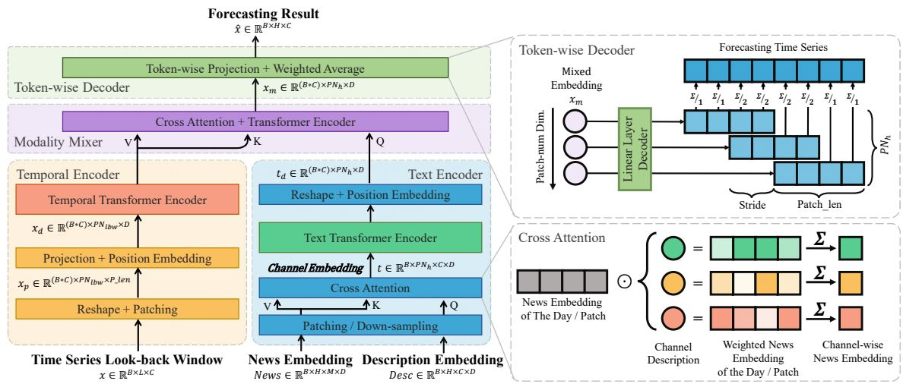  


数据构造：

- Toy：作者按规则生成文本。
- Electricity：作者按星期、工作日、节假日规则生成文本。
- Weather：作者抓天气报告，再用 GPT-4 生成动态天气文本；通道描述也由列名或 GPT-4 生成。
- Steam：作者爬 Steam 新闻作为动态文本，游戏自身信息作为通道描述。

动机：  
1、预测模型方面：简单线性模型（DLinear、FITS）仅从时间序列数据中提取趋势和周期性信息，却经常达到接近最先进复杂模型的性能。这说明当前方法可能已经到达饱和点，并可能过拟合历史数据。基础时序模型在面对外部事件造成的分布偏移时，倾向于学习平均化捷径。  
2、多变量关系方面：权重共享（WS）优先关注通道共同模式，而无法捕捉每个通道的独特分布；可逆实例归一化（RIN）标准化数据输入从而学习更大部分的共同分布，但剥离趋势强度和幅度变化等关键信息，削弱模型检测训练范围之外的相对偏置或幅度变化的能力。  
TGForecaster 的一个关键创新是引入交叉注意力层以实现“文本引导的通道独立性”。  

实验：实验只写了4点，每点写一个数据集，只在第二个数据集做消融，部分做曲线可视化，实验没有亮点可借鉴，是一个反面不好的实验案例。   
主要启发：它适合多变量时序，因为每个变量可以通过通道描述去找自己相关的文本。    
 
主要问题：  
1、构造/读取数据集前，每句文本描述哪个天气已经确定，为什么要用cross-attention去打分再候选，为什么不将静态的通道文本直接加上时序变量和其对应的天气信息的显示的对应关系提前固定在数据集中进行读取？（可能是多变量中，单个变量受主文本的影响，也受其他文本影响，体现了多变量思维，可以把主文本提前透露给变量，其他文本起修正作用，防止找错文本或主文本分数不够大）  
2、模型是多变量，按时间戳，但文本还是窗口级的（时序粒度是10分钟，文本粒度是6小时），只是被每个时间戳复用了，可以把模型改成窗口级，可将数据集整理成6N小时预测6小时的窗口级文本。

## 1.2、TaTS（ICLR 2026）

论文：Language in the Flow of Time: Time-Series-Paired Texts Weaved into a Unified Temporal Narrative  
代码：https://github.com/iDEA-iSAIL-Lab-UIUC/TaTS

TaTS 的思路比较直接：把历史文本编码成1x12维的向量，然后把文本向量接到时序输入里，让时序模型一起处理。  
特点：用cos证明可以将文本当做时序一样具有周期特征的数据  

流程是：

1. 历史文本经过 TinyBERT 编码，pooling 成1个文本向量，再用MLP 降维，过程:  
`[batch,text_len,1]->[batch,text_len,312]->[batch,1,312]->[batch,1,12]*time->[batch,time,12]`  
我们的过程：  
`[batch,text_len,1]->[batch,text_len,312]->[batch,≈TS_len,312]->[batch,≈TS_len,312/TS_dmodel]`

2. 文本向量被当作额外变量，拼到原始时序变量后面，变成` time*([batch,1,1]+[batch,1,12])=[batch,time,13]`。
3. 扩展后的输入交给基础时序模型预测未来`[batch,time,13]->[batch*time,13,dmodel]`。
4. 预测结果再和 `prior_history_avg` 加权融合。

这里的 `prior_history_avg` 不是未来真值，而是从历史窗口中算出来的先验均值。它提供一个简单的历史基准，模型预测是在这个基准上做调整。

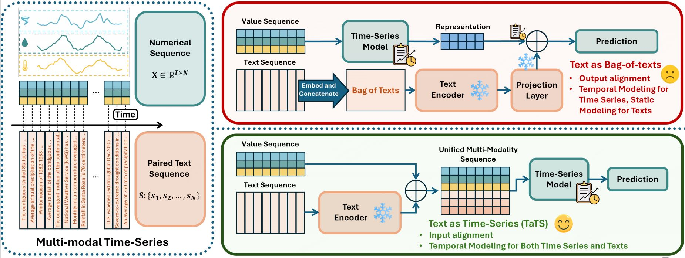
使用TimeMMD的9个数据集Agriculture、Climate、Economy、Security、Social、Traffic、Energy、Health、Environment。

论文还提出 TT 方法，用cos余弦相似度比较文本变化和时序变化是否有相似周期。它想证明：文本不是纯噪声，文本也可能有时间规律。  
但是TT只证明了文本具有和时序相同的周期特征，没有考虑文本是否通过具备理解语义来用。  

动机：  
如果文本真的和时序相关，那么文本表示的变化也可能带有时间规律。论文借用柏拉图表示假设证明文本与时序的相关性（周期相同）：不同模态的表示会收敛至共享空间。在此背景下，通过TT算法(cos余弦计算滞后相似度)计算发现时序配对文本的主导周期分量可能天然呈现与原始时序高度相似的周期性特征。因此，将时序配对文本视为时序的辅助变量，增强时序的周期特性。

论文提出 TT 方法，用余弦相似度比较文本变化和时序变化的主导周期是否相近。比如在月度数据中，原始时序有 12 个月周期，配对文本也可能出现周期为 12、频率约为 0.083 的特征。周期能对齐的原因：共享外部驱动、时序对文本的影响、文本包含时序周期对齐的额外变量。
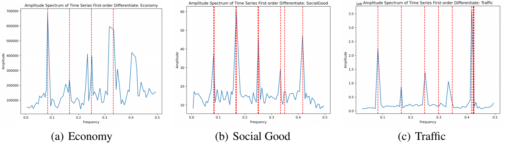
实验：

1. 周期验证：先定性观察文本和时序是否有相同主导周期，再定量计算二者周期表示之间的距离。距离越小，说明文本周期和时序周期越接近,打乱之后周期相似性差距变大。 
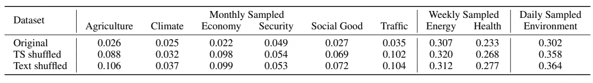  
2. 预测和补全实验：在不同预测长度下比较加入文本后的效果，并做缺失值补全任务。总体上，TT 值越小，说明文本和时序越对齐，模型提升越明显。
3. 文本消融实验：比较原文本、打乱文本、丢弃文本、打乱并丢弃文本。丢弃文本时用“无可用信息”替代。结果说明，有周期结构的原文本通常比打乱或丢弃文本更有帮助，但也存在少数不完全符合规律的样本（红色这几个没有这个规律）。 
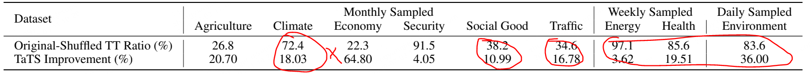
4. 超参数实验：不同文本投影维度的效果差别不大，说明方法对投影维度比较稳健。不同文本编码器下也能保持效果，编码器越大通常提升越明显，但文本编码器规模和预测提升之间的关系仍是开放问题：“探究文本编码器规模与 TaTS 有效性之间的关系仍是未来值得研究的开放方向。”。
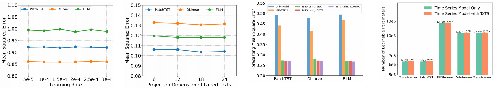
5. 融合方式实验：论文比较了线性投影、门控残差和 cross-attention 三种融合方式，结果线性投影最好。这也说明更复杂的融合方式不一定更有效，后续还可以继续探索更细粒度的融合设计“将探索更细粒度的多模态融合设计作为未来有趣的研究方向”。
6. 开销与收益实验：作者还比较了额外计算开销和性能增益，说明加入文本会增加成本，但在文本和时序对齐较好时收益更明显。

主要启发：文本可以不只作为一句解释，而是可以转成随时间变化的辅助变量。

主要问题：  
1、把文本向量直接拼成变量，融合方式比较粗。模型不一定真的理解文本语义，只是学习文本向量和数值之间的相关性。  
2、把一整段文本压缩为了一个文本向量，把312维度的文本向量压缩为12维度的向量，两次压缩都很严重文本语义是否丢失严重。

# 2、预测区间的窗口级文本：最接近普通多模态预测

这一类方法把一个历史窗口或预测窗口配一段文本，也可能是一个预测区间共享一段描述。它们更像我们要做的数据组织方式：一行样本对应一段历史时序、一段未来时序、一段文本。

## 2.1、Time-MMD / MM-TSFlib（NeurIPS 2024）

论文：Time-MMD: A New Multi-Domain Multimodal Dataset for Time Series Analysis  
代码：https://github.com/AdityaLab/MM-TSFlib

特点：未来文本、时序单独建模、单独预测，最后融合。预测结果=大部分时序模型预测 + 小部分文本修正预测  

流程是：

1. 历史时序输入时序模型，得到未来预测 `outputs：[B, pred_len, 1]`。
2. 文本经过BERT编码，再经过MLP映射成`prompt_emb：[B,text_len,768]->[B,text_len,pred_len]->[B,pred_len,1]`。
3. `prompt_emb` 经过归一化后加上 `prior_y`，得到文本侧预测 `prompt_y`：
```text
prompt_y = norm(prompt_emb) + prior_y
```
5. 最终预测是：

```text
outputs = (1 - prompt_weight) * outputs + prompt_weight * prompt_y
```

如果不用 attention，就对所有 `prompt_emb_i` 做平均池化得到prompt_emb。  
如果用 attention，就用时序预测结果给每个 `prompt_emb_i` 作点积打分，再加权求和得到新的文本预测向量prompt_emb。

这里的 `prompt_emb_i` 不是原始分词 token，而是 BERT token hidden state 经过 MLP 映射后的文本向量。

`prior_y` 是从历史同周期数据中得到的先验，例如：

- 月度数据：上一年同月值，或历史同月均值。
- 周度数据：上一年同周值，或历史同周均值。
- 日度数据：历史同日、同星期或季节窗口均值。

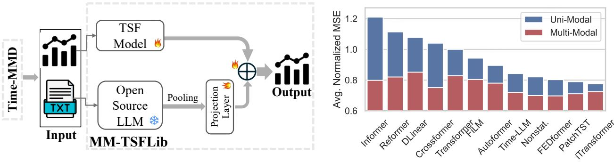
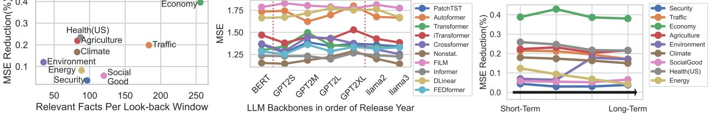

数据集包括 Agriculture、Climate、Economy、Security、Social、Traffic、Energy、Health、Environment。  
动机：MM-TSFlib 既便于基于 Time-MMD 开展多模态 TSA，也可作为评估现有 TSF 模型多模态可扩展性的先导工具。  

实验：  
1.12 种单模态与对应的多模态之间比较提升效果：多模态版本持续优于对应单模态版本。在超过 1000 个实验中，多模态版本在 95% 的情况下优于单模态版本，平均 MSE 降低超过 15%，在文本丰富领域最高降低 40%。  
2.每个领域相关事实数量与多模态扩展带来的 MSE 降低之间的关系(a)。总体上呈正线性相关。但领域特性也会影响效果，例如安全领域关注灾害和紧急补助，未来不可预测性更高，因此从历史文本中获益较少。    
3.不同 LLM 骨干对健康领域多模态性能的影响(b):多模态 TSF 性能与 LLM 自然语言处理能力之间的相关性尚不明确。    
4.不同预测窗口长度下的平均 MSE 降低整体稳定，说明多模态 TSF 对不同预测范围具有较强鲁棒性。    
5.引入从头训练的文本嵌入模型 Doc2Vec 作为 LLM 的替代方案。实验表明 Doc2Vec 也有效，但整体弱于 BERT。MM-TSFlib 将 Doc2Vec 纳入其中，以提升在代表性不足语言和领域中的适用性。    

主要启发：可以把文本看作一个“修正器”，不让文本完全决定预测。

主要问题：如果文本只取预测起点的一条文本，把其他未来时间点的文本信息丢失了，而且这样做也导致它对长预测窗口的信息可能不够。

## 2.2、TextFusionHTS

论文：Unveiling the Potential of Text in High-Dimensional Time Series Forecasting  
代码：https://github.com/xinzzzhou/TextFusionHTS

TextFusionHTS 处理高维时序。它的数据不是每个窗口都有动态文本，而是每条时序有一个固定静态文本。

两个数据集：

- Wiki-People：每个维基百科词条是一条时序，数值是页面访问量，文本是页面内容。
- News：每篇新闻是一条时序，数值是社交反馈随时间变化，文本是新闻正文。  
文本是一个固定静态文本，所有窗口的文本都一样，不预示未来，可以看做的对本变量的描述，通道独立。

模型流程是：

1. 用 Llama-3.1-8B 编码原始文本，得到文本 token 向量。
2. 用 PatchTST 编码历史时序，得到多个时序 patch 表征。
3. 文本 token 作为 query，时序 patch 作为 key/value 做 cross-attention。
4. 文本根据语义去选择重要的历史 patch，对多个历史片段特征 patch 候选项加权求和。
5. 使用融合特征经过线性层输出未来预测。  
即用文本向量去给历史时序 patch 打分，选择哪些时序片段更重要，然后生成融合后的预测表征去预测未来。

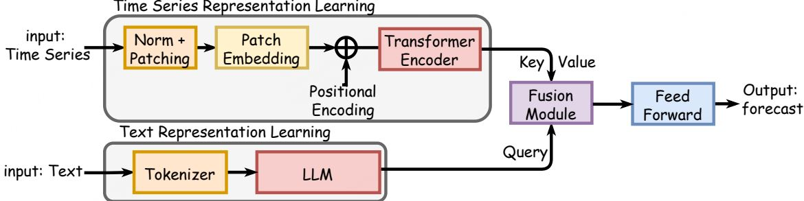


主要启发：静态文本可以用来选择历史片段。例如一个新闻主题可能决定哪些反馈阶段更重要。

主要问题：文本是静态的，不描述未来变化。它更像“变量说明”或“对象描述”，不是事件预告。

## 2.3、MCD-TSF

论文：Multimodal Conditioned Diffusive Time Series Forecasting  
代码：https://github.com/synlp/MCD-TSF

MCD-TSF 是扩散模型版本的多模态时序预测。它使用历史时序、时间戳和历史文本一起预测未来。

整体流程是：

1. 未来序列先从噪声开始。
2. 扩散模型一步步去噪，逐步生成未来时序。
3. 用bert将文本编码为token。
4. 每一步去噪时，都用历史时序、时间戳和文本作为条件。

第4步有2个关键模块：

第一，TAA：Timestamp-Assisted Attention。  
它把时间戳特征和时序值一起放进时间维 attention。模型判断两个时间点是否相关时，不只看数值，也看月份、星期、日期等时间结构。
即在每一步去噪过程后用时间戳（包括年、月、周、日等时间级）作为周期辅助增强信息，增强/强调了周期，将时序点的值和时间戳合并得到增强的时序作为QKV，使得当前时间点的时序值能够找到与同一周期时间点位置的时序值进行cross-attention得到新的时序表达，作为第一次时序修正。  
第二，TTF：Text-Time Series Fusion。  
TAA之后，TTF用时序隐状态作为 query，文本 hidden state 作为 key/value 做 cross-attention。作用是让每个时序位置去文本里找有用语义，选择注意力强的文本hidden对对应的时序值进行第二次修正。

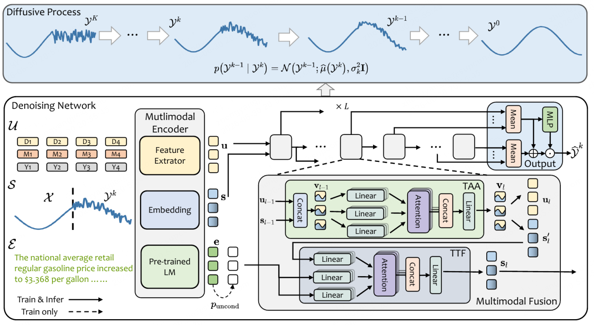

MCD-TSF 使用 Time-MMD 的 8 个领域数据：Agriculture、Climate、Economy、Energy、Environment、Health、SocialGood、Traffic。代码中默认文本编码器是冻结 BERT。

主要启发：文本不直接输出预测值，而是在扩散去噪过程中用时间戳TAA和文本TTF反复影响修正预测。

主要问题：  
1、使用的文本是历史文本，没有使用未来文本。  
2、如何理解通道间语义的传播没有合理说明，扩散模型只是打乱数据再重建数据，利用了时间戳和文本进行引导修正，没有体现语义在哪里。  
3、把文本从bert的768维变成了时序的64维，会不会丢失部分语义，保留文本768维，让时序从64维变成768维会不会更能保留文本语义，但这样会不会丢失时序语义？

# 3、把时序映射到语言模型空间

这一类方法借用 LLM 的序列建模能力。它们的共同点是：把时序 patch 变成 LLM 可以处理的 embedding，再让 LLM 参与预测。

## 3.1、GPT4MTS

论文：GPT4MTS: Prompt-Based Large Language Model for Multimodal Time-Series Forecasting  
代码：https://github.com/Flora-jia-jfr/GPT4MTS-Prompt-based-Large-Language-Model-for-Multimodal-Time-series-Forecasting  
特点：把GPT-2大语言预测能力用来预测时序，输出结果只取时序token部分  

GPT4MTS 用 GDELT 新闻事件数据预测未来事件热度，例如提及次数、文章数量、信源数量。

流程是：

1. 每个时间点历史文本经过 BERT 编码生成1个768维文本向量。
2. 所有文本向量会对其时序patch切分方法也被压缩成少量 soft prompt。
3. 历史时序被切成 patch，并映射到和 GPT-2 hidden size 对齐的向量维度。
4. soft prompt 和时序 patch token 拼在一起送入 GPT-2。
5. GPT-2 输出后，只取时序部分 hidden states，再用线性层预测未来时序。

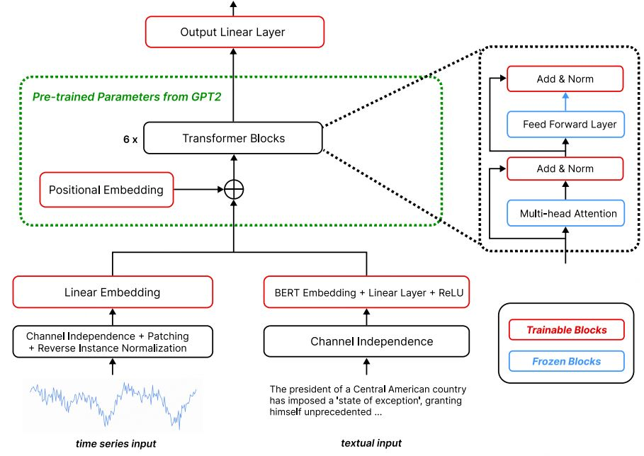

这里的 soft prompt 可以理解成“不是人写的提示词，而是模型学出来的一组文本提示向量”。它不直接可读，但能影响 GPT-2 的注意力。

主要启发：让文本 token 和时序 patch token 在同一个 Transformer 里相互注意。

主要问题：  
1、历史文本和时序都被压缩成少量 token，原始文本长度和数值细节会丢失一部分。  
2、时序的dmodel对齐文本的，不是文本的对齐时序的，尽可能保留语义，可以借鉴，但每天的文本长度被压缩为1，多天文本向量再压成少量 patch prompt token，时序同理，可能导致丢失信息。  
3、文本只是使用历史文本，改成未来文本？  
## 3.2、Time-LLM

论文：Time-LLM: Time Series Forecasting by Reprogramming Large Language Models  
代码：https://github.com/KimMeen/Time-LLM

特点：Time-LLM 的文本不是外部新闻或报告，而是根据历史时序自动生成的 prompt。它更像把时序描述成一段任务说明，再交给冻结 LLM。

流程是：

1. 根据历史时序自动生成一段文本 prompt，包含最大/最小/平均/趋势/周期/滞后等时序特征。
2. 文本 prompt 经过文本编码器得到 prompt embedding。  
3. 历史时序切成 patch后，并通过 PatchEmbedding 得到原始时序 patch embedding。  
4. 原始时序 patch embedding 作为 query，LLM 词表原型向量作为 key/value，经过 ReprogrammingLayer 做 cross-attention，得到 LLM 可以理解的 reprogrammed patch embedding。  
5. prompt embedding 和reprogrammed patch embedding 拼接。  
6. 输入冻结 LLM，最后取时序部分 hidden states 进入线性层得到预测未来。  
类似GPT4MTS，但融合不是用cross-attention，而是先把时序映射到词向量空间，再直接concat词向量化后的时序和原始时序。
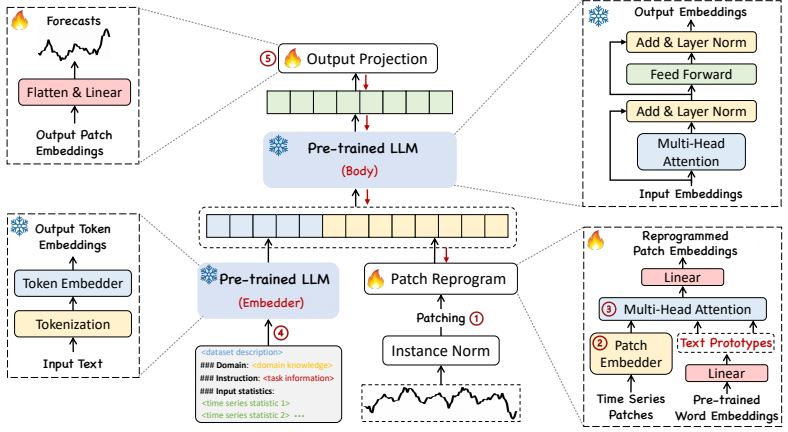

使用的数据集包括 ETTh1、ETTh2、ETTm1、ETTm2、Weather、Electricity、Traffic、ILII，并做了少/零样本迁移适配实验。  

主要启发：不用训练整个 LLM，只学习一个把时序映射到语言空间的接口。

主要问题：  
1、文本主要来自历史时序统计描述，不是外部事件信息，因此它增强的更多是“格式和先验”，不是额外知识。
2、文本的信息从时序中提炼的，没有额外添加时序外信息，这样能带来增强吗？  
3、LLM能理解直接concat的语义级信息吗，还是只是解决冲突，没理解语义？  
4、把连续数值信息变成LLM词表向量后会不会丢失数值特性？  

# 4、把时序和文本都写进 prompt

这一类方法不训练专门模型，而是把任务写成自然语言，让 LLM 直接回答。

## 4.1、CIK

论文：Context is Key: A Benchmark for Forecasting with Essential Textual Information  
代码：https://github.com/ServiceNow/context-is-key-forecasting

CIK 的重点不是提出一个新模型，而是提出一个测试基准：很多预测任务必须依赖文本上下文，只看历史数值会预测错。

它覆盖 7 类场景：Climatology、Economics、Energy、Mechanics、Public Safety、Transportation、Retail（气候学、经济学、能源、力学、公共安全、交通、零售）  
数据集是真实数据集，但未来窗口在原始数值上加入一段文本描述使得数据发生相对于的变化，相当于模拟事实数据集。

每个样本包含：

1. 历史时序。
2. 未来要预测的时间点。
3. 必须阅读的文本上下文，例如政策、节假日、突发事件、物理约束等。

模型使用方式很直接：把历史时序和文本都写进 prompt，让 LLM 输出未来预测值。

主要启发：有些时序变化在历史数值里看不出来，必须靠文本解释。

主要问题：依赖 LLM 的推理和格式遵循能力，不是一个可控的端到端时序模型，体现不出创新性。

## 4.2、xTP-LLM
论文：Towards Explainable Traffic Flow Prediction with Large Language Models  
代码：https://github.com/guoxs/xtp-llm  

xTP-LLM 把交通流预测改成自然语言生成任务，把历史交通流、区域属性、POI、日期、节假日、天气等信息都写进 prompt，让 LLaMA 直接生成未来交通流数值。  

它提出了 CATraffic 数据集，数据来自加州交通流量数据，并加入 POI、天气、节假日等外部信息。任务是用过去 12 小时交通流和相关文本信息，预测未来 12 小时交通流。  

流程是：  

1. 将多模态交通数据构造成 LLaMA chat prompt， prompt 中包含系统提示、交通领域知识、历史交通流数字、区域属性、POI、天气、节假日等信息。  
3. 使用 LLaMA2-7B-chat 作为基础模型进行问答。  
4. 用 LoRA 对 LLaMA 进行监督微调。  
5. 推理时，模型自回归生成未来交通流数字。  
6. 代码用正则表达式从生成文本中抽取预测数字，并多次生成后取平均值。  
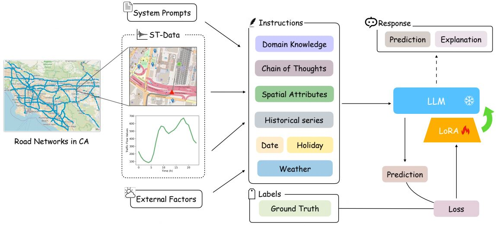
主要启发：可以把多模态时序预测直接转成文本问答任务，让 LLM 同时做预测和解释。  

# 5、对我们工作的启发

如果目标是做“历史窗口时序 + 未来窗口文本 -> 未来窗口时序”，最接近的是 Time-MMD/MM-TSFlib、MCD-TSF、TaTS 和 TextFusionHTS。

可以借鉴思考的地方：

1. 文本粒度要先定清楚：每个时间点一段文本、每个窗口一段文本，还是每条时序一个静态描述。
2. 文本使用方法包括：直接主导预测，或者作为修正项或 attention 条件。
3. 如果文本是未来文本，必须说明真实预测时是否可获得，否则容易变成信息泄露。
4. 如果文本是历史文本，重点是让模型学到“哪些历史事件会影响未来”。
5. 多变量任务中，通道描述很有用。它能告诉模型每个变量应该关注哪类文本。
